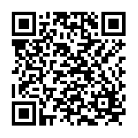

# KMovableArea / KMovableView

成对使用的组件，`MovableView` 可以在 `MovableArea` 的范围内拖拽移动、缩放。对齐微信小程序的 [movable-area](https://developers.weixin.qq.com/miniprogram/dev/component/movable-area.html) 和 [movable-view](https://developers.weixin.qq.com/miniprogram/dev/component/movable-view.html)

需要注意，在实际使用中，__`MovableArea` 必须是 `MovableView` 的直接父亲__。

## 使用指南

```js
import {KMovableArea, KMovableView} from 'kbone-ui'
```

```vue
<KMovableArea class="movable-area">
  <KMovableView
    ref="movableView"
    :x="x"
    :y="y"
    class="movable-view"
    direction="all"
    @change="onChange"
    @scale="onScale"
    @htouchmove="onMove"
    @vtouchmove="onMove"
  >
    view
  </KMovableView>
</KMovableArea>
```

## 示例

> 手机扫码查看示例



## 使用参数

### KMovableArea

| 属性 | 类型 | 默认值 | 必填 | 说明 |
| ---- | ---- | ------ | -------- | ---- |
| scale-area | Boolean | false | 否 | 当里面的movable-view设置为支持双指缩放时，设置此值可将缩放手势生效区域修改为整个movable-area |

### KMovableView

| 属性 | 类型 | 默认值 | 必填 | 说明 |
| ---- | ---- | ------ | -------- | ---- |
| `direction` | string | none | 否 | movable-view的移动方向，属性值有all、vertical、horizontal、none |
| `inertia` | boolean | false | 否 | movable-view是否带有惯性 |
| `out-of-bounds` | boolean | false | 否 | 超过可移动区域后，movable-view是否还可以移动 |
| `x` | number |  | 否 | 定义x轴方向的偏移，如果x的值不在可移动范围内，会自动移动到可移动范围；改变x的值会触发动画 |
| `y` | number |  | 否 | 定义y轴方向的偏移，如果y的值不在可移动范围内，会自动移动到可移动范围；改变y的值会触发动画 |
| `damping` | number | 20 | 否 | 阻尼系数，用于控制x或y改变时的动画和过界回弹的动画，值越大移动越快 |
| `friction` | number | 2 | 否 | 摩擦系数，用于控制惯性滑动的动画，值越大摩擦力越大，滑动越快停止；必须大于0，否则会被设置成默认值 |
| `disabled` | boolean | false | 否 | 是否禁用 |
| `scale` | boolean | false | 否 | 是否支持双指缩放，默认缩放手势生效区域是在movable-view内 |
| `scale-min` | number | 0.5 | 否 | 定义缩放倍数最小值 |
| `scale-max` | number | 10 | 否 | 定义缩放倍数最大值 |
| `scale-value` | number | 1 | 否 | 定义缩放倍数，取值范围为 0.5 - 10 |
| `animation` | boolean | true | 否 | 是否使用动画。设置为 `false` 时存在问题，参考下面[已知问题](#已知问题) |
| `change` | event |  | 否 | 拖动过程中触发的事件，`event.detail = {x, y, source}` |
| `scale` | event |  | 否 | 缩放过程中触发的事件，`event.detail = {x, y, scale}` |
| `htouchmove` | event |  | 否 | 初次手指触摸后移动为横向的移动时触发 |
| `vtouchmove` | event |  | 否 | 初次手指触摸后移动为纵向的移动时触发 |

#### `bindchange` 返回的 `source` 表示产生移动的原因

| 值 |  说明  |
| ---- | ----- |
| `touch` | 拖动 |
| `touch-out-of-bounds` | 超出移动范围 |
| `out-of-bounds` | 超出移动范围后的回弹 |
| `friction` | 惯性 |
| 空字符串 | 属性变化 |

## 已知问题
- 当 `MovableView` 的属性 `animation` 被设置为 `false` 时，按照 Vue 的现有逻辑，`animation` 属性将在 DOM 上被移除，进而小程序端的 `movable-view` 读取不到开发者设置的 `animation=false`，并回落到默认值 `true`。这导致 `:animation="false"` 在小程序端设置无效。目前可以将 `animation` 设置为空字符串来代替：
  ```vue
    <KMovableView :animation="''" />
  ```