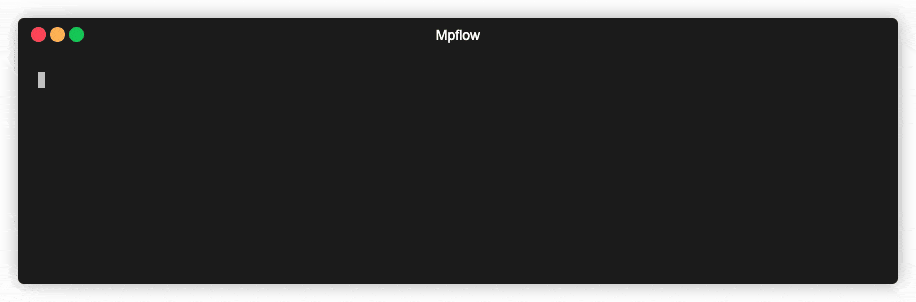
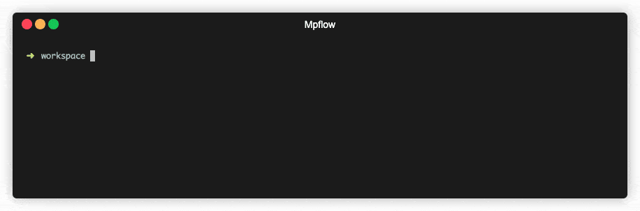

# 快速开始

::: warning 注意
Mpflow 需要 [Node.js](https://nodejs.org/zh-cn/) >= 10
:::

## 创建新项目

本指引将指引安装 mpflow 并创建一个小程序项目并开启开发

1. ### 安装 mpflow 命令行
    通过包管理工具全局安装 `@mpflow/cli`
    ```bash
    # 使用你最喜欢的包管理器全局安装
    npm install @mpflow/cli -g
    # 或
    yarn global add @mpflow/cli
    ```

    

    安装完毕之后会在全局注册一个 `mpflow` 命令，你可以使用 `mpflow --help` 来查看安装效果

    ```bash
    # 查看 mpflow 命令说明
    mpflow --help
    ```

1. ### 创建 mpflow 项目
    通过 `mpflow create` 命令即可创建 mpflow 项目
    ```bash
    # 创建一个名为 hello-mp 的小程序项目
    mpflow create hello-mp
    ```

    

    ::: warning 注意
    创建项目时会要求输入一个小程序 appId，不能被跳过

    你可以在 [申请地址](https://developers.weixin.qq.com/sandbox) 申请测试号后填入
    :::

    创建项目时会询问是否安装官方插件，如 typescript 插件、css 插件、测试插件等等。

    也可以通过 `--template` 参数来指定项目模板，创建不同类型的项目

    ```bash
    # 默认，创建小程序项目
    mpflow create hello-mp --template miniprogram
    # 创建小程序插件项目
    mpflow create hello-plugin --template miniprogram-plugin
    # 创建小程序组件库项目
    mpflow create hello-comps --template miniprogram-components
    ```

    ::: tip 提示
    一旦通过 mpflow 创建后的项目，其构建能力是不依赖全局的 `@mpflow/cli` 命令行的

    意味着你可以放心地使用本地 npm 命令如 `npm run dev` 和 `npm run build` 代替 `mpflow dev` 和 `mpflow build`

    当进行多人开发时，其余的开发者也不需要安装 `@mpflow/cli` 即可运行项目
    :::

1. ### 启动开发
    通过 `dev` 命令可以开启本地文件监视，并自动拉起小程序开发工具
    ```bash
    # 进入刚刚创建的小程序项目
    cd hello-mp
    # 开始开发，并自动拉起小程序开发工具
    mpflow dev --open # 也可以用 npm run dev:open
    ```

    ::: warning 注意
    当使用 `--open` 自动拉起小程序开发者工具时，要求当前电脑必须安装了 [微信开发者工具](https://developers.weixin.qq.com/miniprogram/dev/devtools/devtools.html)

    并且要求开发者必须要登录为当前小程序 APPID 开发者
    :::

1. ### 构建产物
    通过 `build` 命令可以构建生产模式的代码，生产模式下会对代码进行压缩等优化

    ```bash
    # 进入刚刚创建的小程序项目
    cd hello-mp
    # 构建小程序产物
    mpflow build # 也可以用 npm run build
    ```

    

1. ### 安装插件
    通过 `add` 命令为项目安装插件

    ```bash
    # 进入刚刚创建的小程序项目
    cd hello-mp
    # 为项目安装小程序瘦身插件
    mpflow add slim # 会为项目自动安装 @mpflow/plugin-slim 插件
    ```

    
